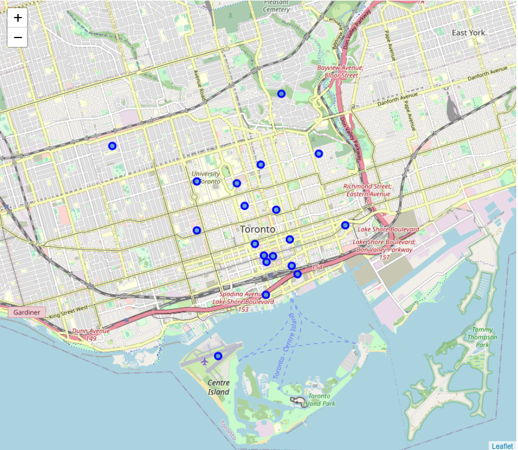
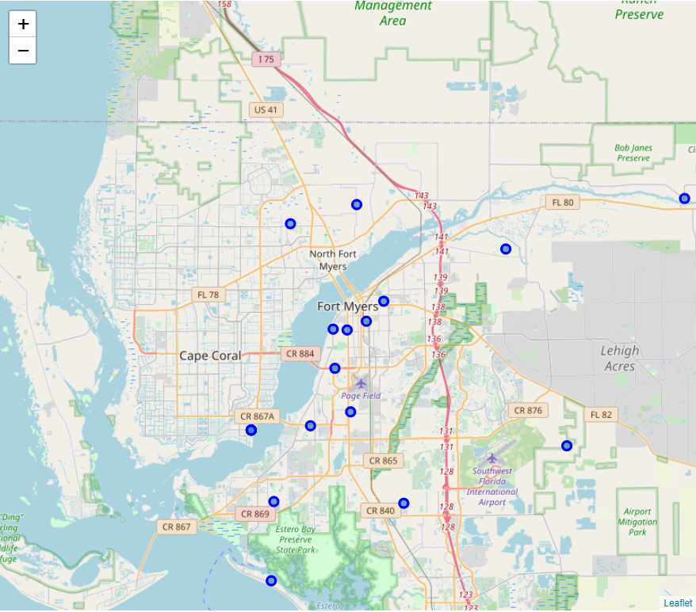
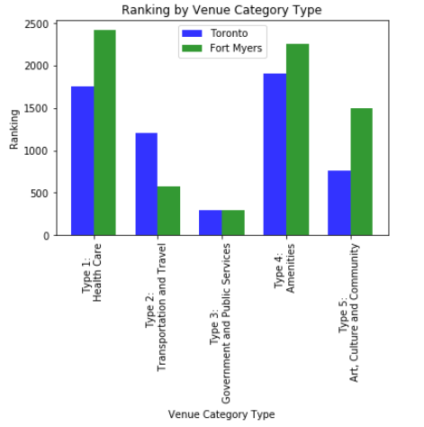

# The Best Neighborhood for Your Retirement Life
<hr/>

<p><em>IBM Data Science Professional Certificate - Applied Data Science Capstone</em></p>

## Introduction
<hr/>

<p>Retirement is an exciting phrase, it marks the end of the regular 9 to 5 working days and the start of a new journey. People are having different preferences on their retirement lives, and one of the major topcis is to move to a new place for enjoying the rest of their lives. Researches finds that both Toronto and Fort Myers are two of the best cities for retirement in the North America. In this project, we aim to analyze the features and characteristics of these two cities, and determine which of them is the best neighborhood for retiring in the Norht America.</p>

## Data Section
<hr/>

<p>
The two neightbourhoods are chosen for comparison based on the studies about retirement community by highly recognized sources. Toronto is picked by Maclean's, a Canadian news magazine found in 1905 which bring Canada related issues to the public (<a href="https://www.macleans.ca/economy/best-communities-retire-canada-2019/">https://www.macleans.ca/economy/best-communities-retire-canada-2019/</a>). Fort Myers is selected by U.S. News & World Report, a U.S. based a multi-platform publisher of news and information (<a href="https://realestate.usnews.com/places/florida/fort-myers">https://realestate.usnews.com/places/florida/fort-myers</a>). In this study, Downtown toronto is used instead of the whole Toronto area since downtown area is more comparable to Fort Myers in terms of areas and populations.
</p>

<p>Foursquare API is used to retieve the information of the two targeted cities, Toronto and Fort Myers. In addition, findings from researches and surveys, which are about the types of facilities and services people are looking for in their retirements, will be taken into account for the analysis in this study. The information we can retrieve focus on facilities and services available in the city area, comparison will be done based on them to determine which city is the best for retirement.</p>

<p>Toronto and Fort Myers Neighborhood data are obtained from online database:
    <ul>
        <li>Toronto: <a href="https://en.wikipedia.org/wiki/List_of_postal_codes_of_Canada:_M">https://en.wikipedia.org/wiki/List_of_postal_codes_of_Canada:_M</a></li>
        <li>Fort Myers: <a href="https://public.opendatasoft.com/explore/dataset/us-zip-code-latitude-and-longitude/table/">https://public.opendatasoft.com/explore/dataset/us-zip-code-latitude-and-longitude/table/</a></li>
    </ul>
</p>

## Methodology
<hr/>

<p>
The focus of this study is to determine the best retirement neighborhood among Toronto and Fort Myers. The analysis uses the following two API provided by Foursquare API:</p>
    <ol>
        <li>https://api.foursquare.com/v2/venues/categories?&client_id={}&client_secret={}&v={}</li>
        <li>https://api.foursquare.com/v2/venues/search?&client_id={}&client_secret={}&v={}&ll={},{}&radius={}&limit={}</li>
    </ol>
<p>
The first API is used for getting a list of all venue categories in Foursquare API. The list is filtered to only include the concerning factilities and services for retirees, and then served as the baseline for comparison between the two neighborhoods. The filtering is based on the methodology used in Maclean's analysis on the best communities for retirement (<a href="https://www.macleans.ca/economy/best-communities-in-canada-2019-methodology/">https://www.macleans.ca/economy/best-communities-in-canada-2019-methodology/</a>). Five venue category types are shortlisted, and their corresponding scores are assigned.
    <ol>
        <li>Type 1: Health Care (20 points)</li>
        <li>Type 2: Transportation and Travel (10 points)</li>
        <li>Type 3: Government and Public Services (2.5 points)</li>
        <li>Type 4: Amentiesi (2.5 points)</li>
        <li>Type 5: Art, Culture and Community (5 points)</li>
    </ol>
</p>    
<p>
The second API is used to obtain the venue around the neighborhoods. The API is limited to get 100 venues at maximum per request and 500m of searching radius.
</p>
<p>
Afterwards, the venues are filtered based on the list obtained by the first API, and scores are applied to the result sets based on the list of filtered venues. A bar plot is used for plotting the scores against each other for a direct comparison.
</p>

## Results
<hr/>

<p>
    First, maps for the two neighborhoods are drawn for familizing the neighborhoods:
</p>
<p>
    <strong>Toronto:</strong><br/>
    
</p>
<p>
    <strong>Fort Myers:</strong><br/>
    
</p>

<p>
    The sizes of both neighborhoods are comparable to each other. The visualization of the data and comparison upon five types of venue category is shown below:<br/>
    
</p>
<p>
    Result of the analysis is showing in the aforementioned bar chart. Both cities are performing better than their counterparts in some areas. 
To summarize the finding, Fort Myers is winning in Health Care and Art, Culture and Community, while Toronto is surpressing Fort Myers in Transportation and Travel. Both cities are comparable to each other in Governemnt and Public Services and Amenties categories.

Therefore, we can conclude that Fort Myers overtook Toronto in the contest of being the best retirement community in the North America region, though only winning by a nose. 
</p>

## Discussion
<hr/>

<p>
    It is very important to note that the result of the above analysis does not necessary mean that Toronto is bad as a retirement community, given that Fort Myers is only winning in a narrow margin, and Toronto even ties or wins in some categories.
</p>
<p>
    Another important point to look at is about the nature of this study. The analysis is based on the data obtained by Foursquare API, which is heavily focused on facilities and services venue in the search area. While such aspect is essential for picking the winner, there are more subjects to account for to improve the studies comprehensiveness, for example, weather, crime rate, affordability of living and tax rate. People have their own preferences on different aspects when picking the nicest place for retirement in their point of view. As a result, the next step of this study is to include additional crtierias, adjust the scoring system and perform the analysis in a more diversified approach.
</p>

## Conclusion
<hr/>

<p>
    Based on the data analysis and visualization, Fort Myers is considered to be the best place for retirement in the North America region. Retirees could enjoy a good combination of different facilities and services to spend the rest of their lives.
</p>


```python

```
